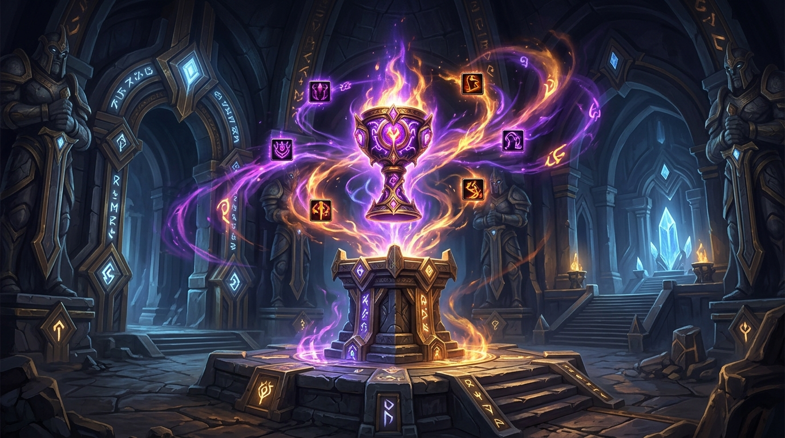

# MythicPlus Extended for AzerothCore (Eluna + AIO)

<p align="center">
  
</p>

<p align="center">
  <a href="https://github.com/azerothcore/azerothcore-wotlk"></a>
  <a href="https://github.com/azerothcore/mod-eluna"></a>
  <a href="https://github.com/Rochet2/AIO"></a>
  <a href="https://github.com/Ildourol/MythicPlus-extended/blob/master/LICENSE"></a>
</p>

---

## Description

**MythicPlus Extended** introduces a complete modern Mythic+ dungeon system to AzerothCore (Wrath of the Lich King 3.3.5a), implemented via the **Eluna** Lua engine and the **AIO** (All-In-One) client-server communication framework.

It features full keystones scaling without artificial tier caps, dynamic weekly affix pools, real-time GUI timers, enemy forces win conditions, overtime completions, performance-bracketed loot, and an automated weekly Great Vault in Dalaran.

---

## Features

- **Single Keystone Progression**: Players maintain a single persistent keystone that upgrades (+1 to +3) or downgrades based on completion time and performance.
- **Uncapped Keystone Tiers**: Infinite scaling of creature health, damage, and encounter mechanics.
- **Blizzlike Rating System**: Implements the official Mythic+ dungeon rating calculation model.
- **Enemy Forces Win Condition**: Requires defeating a configured quota of trash mobs in addition to bosses to complete the run.
- **Overtime Completion**: If the timer expires, players can still finish the dungeon to earn item rewards without rating gains.
- **Custom Affix System**: 8 unique affixes with boss exclusions to ensure fair encounter pacing.
- **Configurable Death Penalty & Limits**: Configurable run failure limits based on party deaths.
- **AIO In-Game GUI**: Custom HUD showing live timer, death counts, affix icons, enemy forces percentage, and boss status without requiring client addon installation beyond the patch.
- **Weekly Great Vault**: Interactive vault in Dalaran (in front of the Violet Hold) offering weekly reward choices every Wednesday at 8:00 AM server time.
- **Smart Loot Distribution**: Drops gear, mounts, pets, or spells based on keystone brackets with class, armor proficiency, and faction filtering.

---

## Requirements

- [AzerothCore WotLK (branch `master`)](https://github.com/azerothcore/azerothcore-wotlk)
- [mod-eluna](https://github.com/azerothcore/mod-eluna)
- [AIO (All-In-One)](https://github.com/Rochet2/AIO)

---

## Directory Structure

```
MythicPlus/
├── Data/
│   ├── Client/                     # Client patch raw files and documentation
│   │   ├── Raw/                    # Interface icons, sounds, textures, and DBC diffs
│   │   └── README.md
│   └── SQL/
│       ├── characters/             # Character database tables (keys, rating, vault, history)
│       └── world/                  # World database tables (loot tables, pedestals, keystones)
├── MythicPlus/
│   ├── Mythic_Client.lua           # AIO client GUI and HUD rendering logic
│   ├── Mythic_Locale.lua           # Localization definitions
│   └── Mythic_Server.lua           # Server-side Eluna dungeon mechanics & affix engine
├── assets/                         # Documentation media
└── LICENSE                         # GNU General Public License v3
```

---

## Installation

1. **Server Lua Scripts**:
   Place the `MythicPlus` folder into your AzerothCore server `lua-scripts/` directory:
   ```
   azerothcore/lua-scripts/MythicPlus/
   ```

2. **Database Setup**:
   - Import all `.sql` files from `Data/SQL/world/` into your `acore_world` database:
     - `creature_and_keystones.sql`
     - `world_mythic_loot.sql`
     - `world_vault_loot.sql`
   - Import all `.sql` files from `Data/SQL/characters/` into your `acore_characters` database:
     - `character_mythic_keys.sql`
     - `character_mythic_rating.sql`
     - `character_mythic_vault.sql`
     - `character_mythic_history.sql`
     - `character_mythic_weekly_affixes.sql`

3. **Client Patch Setup**:
   - Follow instructions in [`Data/Client/README.md`](Data/Client/README.md) to generate the custom client patch containing interface textures, sounds, and DBC entries.
   - Distribute the generated `.mpq` patch to players' `Data/` folder.

4. **Restart Worldserver**:
   - Restart the server and client to initialize tables and Eluna handlers.

---

## How to Play

1. **Obtain a Keystone**: Complete any standard Heroic dungeon to receive your starting Mythic Keystone.
2. **Activate the Pedestal**: Enter the dungeon on Heroic difficulty and interact with the Mythic Pedestal (Creature ID `900001`) at the entrance.
3. **Beat the Timer**: Eliminate required enemy forces and defeat all bosses before the countdown finishes.
4. **Collect Rewards**: Open the end-of-run chest and claim weekly Great Vault rewards in Dalaran.

---

## Credits & License

- Inspired by [Doodihealz/MythicPlus](https://github.com/Doodihealz/MythicPlus).
- Script framework authored by huptiq.
- Licensed under the [GNU General Public License v3](LICENSE).